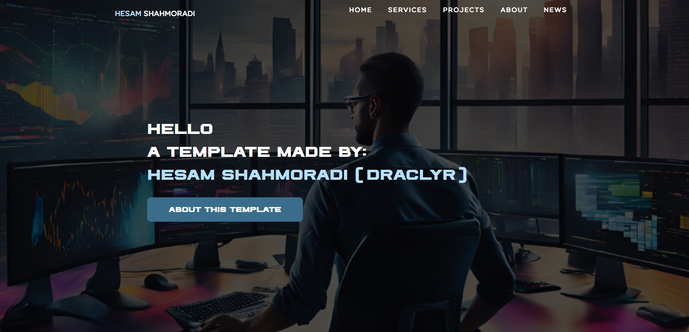
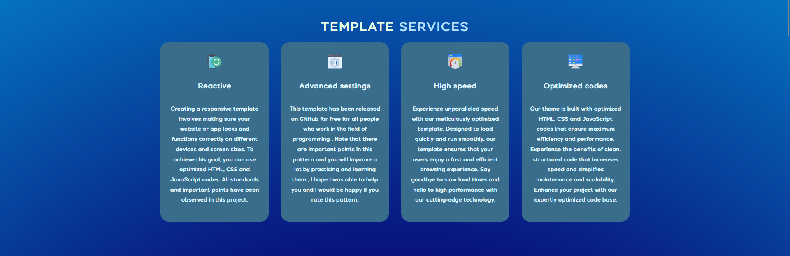
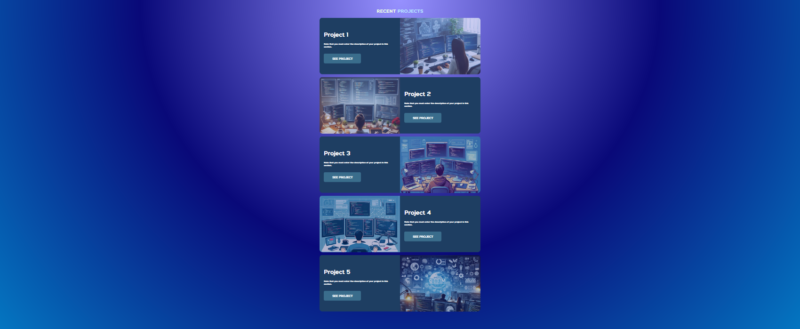
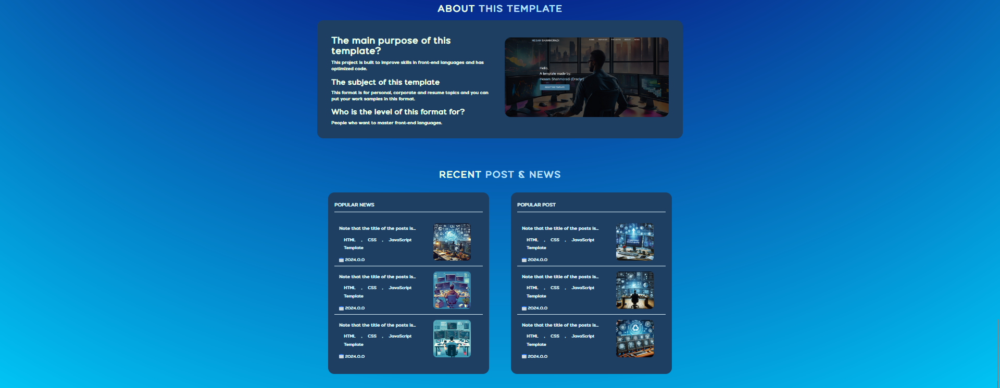

# About Nexgen

<h2 text-align="center">
🌐In this template of html, css, javascript languages
It is used and has optimal and practical codes.</h2>

A view of the main part of the template:

<h2 text-align="center">What is the topic of this template?🤔</h2>

This is a corporate and personal website and resume that provides all the required items and is editable and developers can use this template.
Part of the services of this template:

<h3 text-align="center">Can we put our projects on this resume website?😻</h3>

Of course yes! By developing this template, you can place all portfolios
But I also left a professional section for this topic😏:

You can also put descriptions about yourself and your work field on the main page of the template and display work news or popular posts in the other part😇

</a>

And finally, I will be very happy if you rate the project❤️

