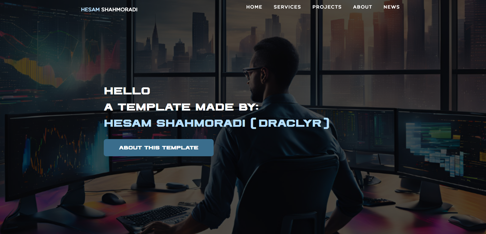
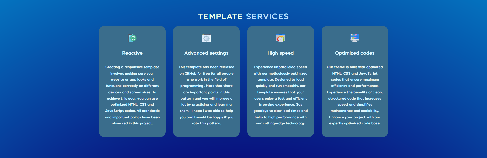
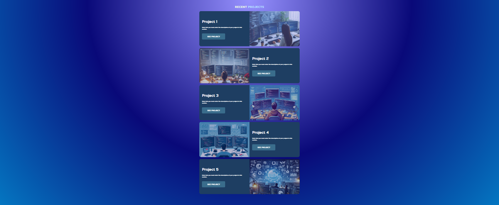
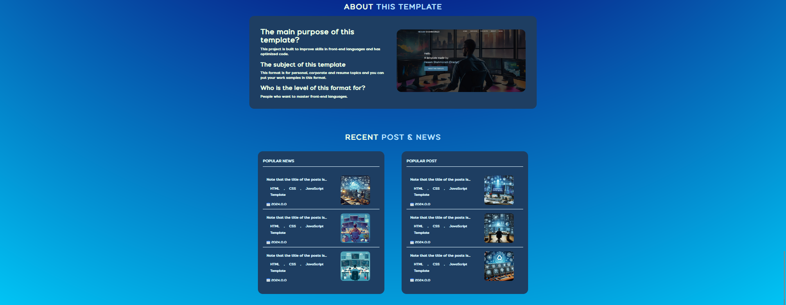

# About Nexgen

<h2 text-align="center">
🌐This template utilizes HTML, CSS, and JavaScript, featuring optimized and practical code for efficient performance.</h2>

An overview of the main section of the template:

<h2 text-align="center">What is the topic of this template?🤔</h2>

This is a corporate and personal website and resume template that provides all the necessary features. It is fully editable, allowing developers to customize and use it efficiently:

<h3 text-align="center">Can we showcase our projects on this resume website?😻</h3>

Of course, yes! By expanding this template, you can showcase all your portfolios. Additionally, I have included a dedicated professional section for this purpose😏:

You can also include a professional summary about yourself and your field of expertise on the main page of the template. Additionally, you have the option to feature industry-related news or highlight popular posts in a dedicated section😇

</a>

Finally, I would be delighted if you could rate the project❤️

